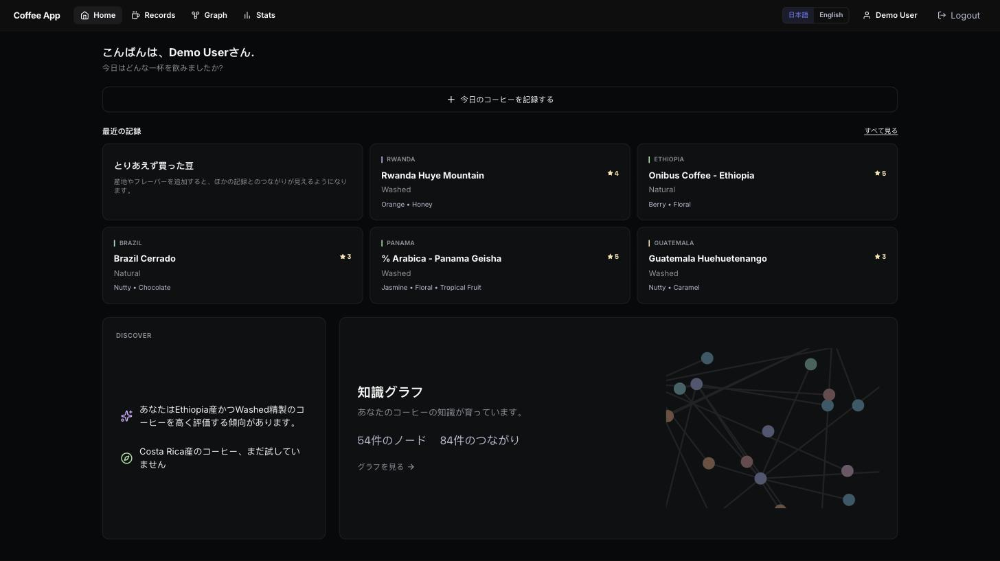
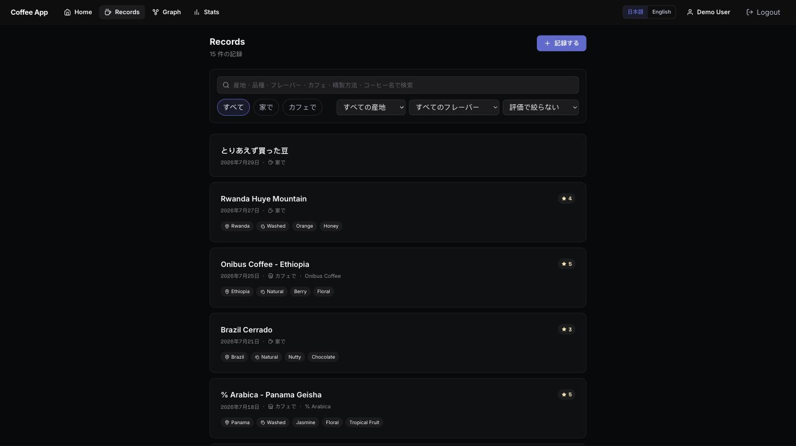
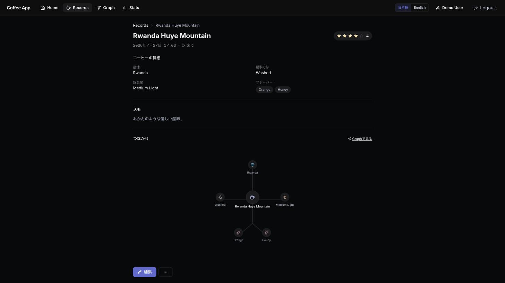
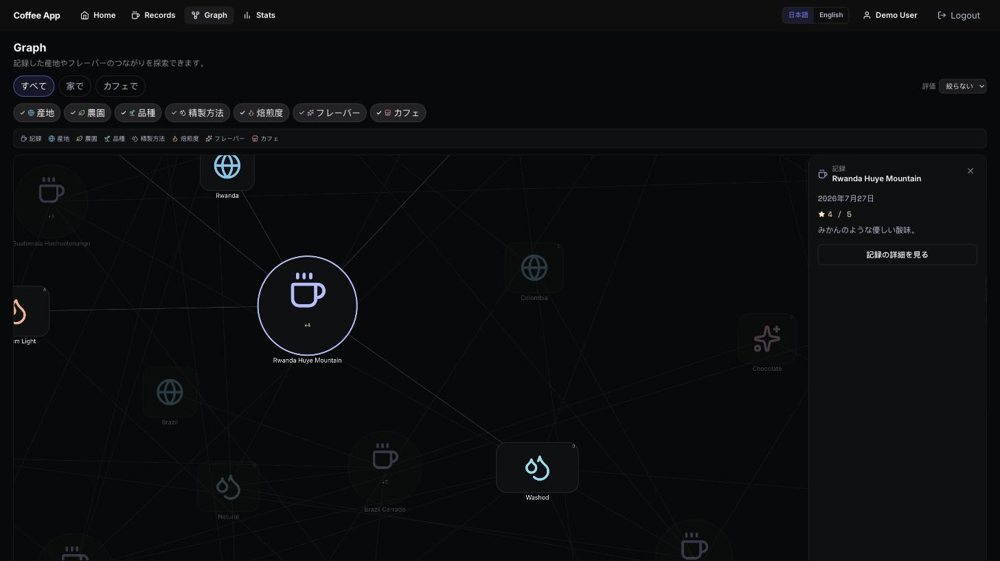
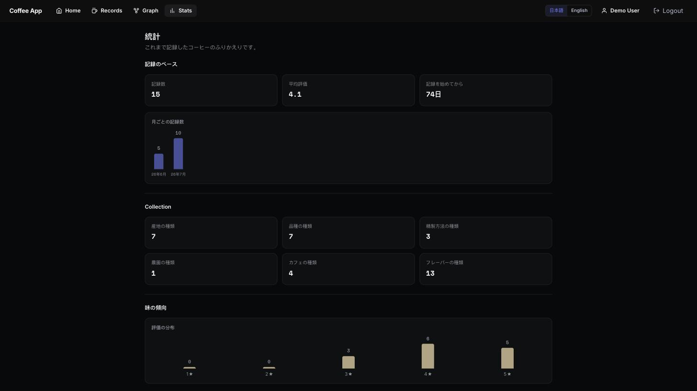
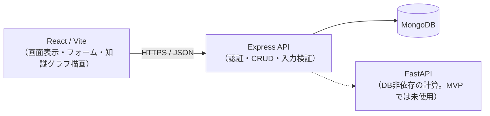

# Coffee App

コーヒー体験を記録し、知識グラフとして育て、自分の味覚やコーヒーの知識を自然に発見できるアプリ。
自社開発スタートアップの長期インターン応募のために作成した、学習用・ポートフォリオ用のWebアプリです。

---

## 目次

1. [Overview](#overview)
2. [Screenshots](#screenshots)
3. [Demo](#demo)
4. [Core Experience](#core-experience)
5. [Features](#features)
6. [Architecture](#architecture)
7. [Tech Stack](#tech-stack)
8. [Data Model](#data-model)
9. [Knowledge Graph](#knowledge-graph)
10. [Setup](#setup)
11. [Environment Variables](#environment-variables)
12. [Testing](#testing)
13. [Design Decisions](#design-decisions)
14. [Future Work](#future-work)

---

## Overview

一般的なコーヒー記録アプリは、記録が時系列に並ぶだけで、体験同士の関連や自分の味覚傾向を発見しにくいという課題があります。このアプリは、コーヒーを単に保存する対象ではなく、**記録するほど理解が深まる個人知識ベース**へ変えることを目指しています。

主な対象は、スペシャルティコーヒーに興味を持ち始めた人、自宅とカフェの両方でコーヒーを飲む人、詳しい専門知識はないが自分の好みを知りたい人です。豆を購入するECサイトや、専門家向けの厳密なカッピング管理システムではありません。

詳しくは [`docs/product.md`](docs/product.md) を参照してください。

## Screenshots

| Home | Records |
| --- | --- |
|  |  |

| Record Detail | Graph |
| --- | --- |
|  |  |

**Stats**



## Demo

ローカルで起動後、以下のデモアカウントでログインすると、15件のサンプル記録と知識グラフをすぐに確認できます。

```
Email:    demo@coffee-app.example
Password: coffeedemo123
```

デモデータは `npm run seed:demo` で投入します（[Setup](#setup) 参照）。エチオピア・ケニアを中心に、産地・フレーバーが記録をまたいで重なるように構成してあり、Graph画面でノードが自然にクラスタ化される様子を確認できます。

## Core Experience

中心体験は **Record → Connect → Discover**（記録する → つながる → 発見する）です。

1. **Record** — 飲んだコーヒーを、産地・農園・品種・精製方法・焙煎度・フレーバーとともに記録する
2. **Connect** — ユーザーがグラフ構造を直接編集するのではなく、記録に選択された要素からアプリが自動でノードとエッジを生成する
3. **Discover** — ノード・関連記録・フィルターを辿り、「自分はこの産地やフレーバーをよく選んでいる」と気づける

すべての機能は、この循環のどこを改善するかを説明できる必要があります（[`docs/product.md`](docs/product.md)）。

## Features

**MVPの中心機能**

- **認証** — 新規登録・ログイン・ログアウト・JWTによる認証状態の維持
- **Coffee Records** — 記録の一覧・作成・詳細・編集・削除。home/cafeの2種別、フィルター（記録タイプ・評価）とページネーション
- **Knowledge Graph** — 自分の記録から導出される知識グラフ。ノードのズーム/パン、種別フィルター、ノード選択による詳細・関連記録の表示、記録詳細画面との相互遷移
- **Master Data** — 産地・品種・精製方法・焙煎度・フレーバーの参照データ。表記揺れを防ぎ、同じ概念を1つのノードへ統合する
- **Home / Profile** — 最近の記録とグラフへの導線を持つホーム画面、名前変更・パスワード変更・退会を行える最小限のプロフィール画面

**MVP完成後に追加した機能**（[`docs/features.md`](docs/features.md)）

- **Insights** — 記録データの傾向をルールベースで検出し、「エチオピア産かつナチュラル精製を高く評価する傾向があります」のような一文で提示する。自由記述の`notes`は読まず、構造化データの集計のみで組み立てる（AI・自然言語処理ではない）
- **Search** — 記録・産地・農園・品種・精製方法・フレーバー・カフェを横断して検索し、よく共起する別の属性もあわせて表示する
- **Entity Detail** — 産地やフレーバーなど、知識グラフのノード1件について統計・関連する他の属性・関連記録をまとめて見せる専用ページ。関連属性のチップ自体もリンクになっており、産地→品種→フレーバーとページ間を渡り歩ける
- **Stats** — これまでの記録を「記録のペース」「Collection（試した種類数）」「味の傾向」の3セクションで振り返るページ
- **Discover** — CQI（Coffee Quality Institute）の参考データと知識グラフの隣接関係を使い、「よく選んでいる精製方法で、まだ試していない産地」を提案する

Out of Scope（MVPでは扱わない）: AI推薦、自然言語による味覚分析、SNS・フォロー、カフェ口コミ、EC連携、画像認識。詳細は [`docs/mvp.md`](docs/mvp.md) を参照してください。

## Architecture



- **React** — UI・ルーティング・フォーム・API状態・知識グラフの描画
- **Express** — 認証・認可、CoffeeRecordとマスターデータのCRUD、知識グラフの生成（`routes → controllers → services → repositories/models`）
- **FastAPI** — DB非依存の計算処理専用。MVPでは知識グラフの変換をExpress内の純粋関数（`backend/core/graph`）で行っており、実装済みの機能は無い（下記 Design Decisions 参照）
- **MongoDB** — users / coffeeRecords / マスターデータ（origins, varieties, processes, roastLevels, flavors）

frontend は FastAPI へ直接アクセスせず、MongoDB へも直接接続しません。FastAPI は MongoDB へ接続せず、認証も行いません。責務の詳細は [`docs/architecture.md`](docs/architecture.md) を参照してください。

### ディレクトリ構成

```text
coffee-app/
├── docs/                      仕様・設計ドキュメント（仕様の正）
├── prompts/                   Phase単位の実装指示
├── frontend/src/
│   ├── features/
│   │   ├── coffee-records/    記録機能のAPI・hooks・components
│   │   ├── graph/             知識グラフのAPI・hooks・components（react-force-graph-2d）
│   │   ├── insights/ discover/ search/ stats/   個別機能ごとに同じ構成
│   ├── pages/                 ルート単位の画面
│   └── components/            複数機能で共有するUI
├── backend/
│   ├── core/graph/ insights/ discover/ search/ stats/   機能ごとの純粋関数（DB/HTTP非依存）
│   ├── routes/ controllers/ services/ repositories/ models/ validators/
│   └── seeds/                 マスターデータ・デモデータの投入
├── fastapi-service/           FastAPI（ヘルスチェックのみの最小構成）
└── docker-compose.yml
```

## Tech Stack

| レイヤー | 技術 |
| --- | --- |
| Frontend | React 19 / Vite / React Router / Tailwind CSS |
| 知識グラフ描画 | react-force-graph-2d（canvas描画 + d3-force） |
| Backend | Node.js / Express 5（ES Modules） |
| Database | MongoDB / Mongoose |
| 計算サービス | Python / FastAPI |
| 認証 | JWT / bcryptjs |
| テスト・CI | Jest + Supertest / mongodb-memory-server / pytest / GitHub Actions |
| 開発環境 | Docker Compose |

frontend・backend とも ES Modules を使用します。採用理由と落とし穴は [`docs/architecture.md`](docs/architecture.md#module-format) にまとめています。

## Data Model

中心エンティティは `CoffeeRecord`（1回のコーヒー体験）です。

```js
{
  userId, title, consumedAt, recordType,   // recordType: "home" | "cafe"
  rating, notes, cafeName, roasterName,
  originId, farmName, varietyIds, processId, roastLevelId, flavorIds,
}
```

`origin` / `variety` / `process` / `roastLevel` / `flavor` は別コレクションへの参照にし、表記揺れを防いで知識グラフで同じ属性を1ノードに統合できるようにしています。`farm` だけはマスター化せず `farmName` という文字列で持たせています。農園はデータ品質を担保しにくく、MVPの段階でマスター化すると重複だらけになるためです。

各マスターは表示用の `name` と、比較用に正規化した `normalizedName`（`unique`）を持ちます。`RoastLevel` だけは値が5段階に固定されているため、`normalizedName` の代わりに `key`（`light`〜`dark`）と並び順の `order` を持ちます。

詳細は [`docs/domain-model.md`](docs/domain-model.md)・[`docs/database.md`](docs/database.md) を参照してください。

## Knowledge Graph

知識グラフは装飾ではなく、記録同士の共通点と自分の嗜好を探索するためのUIです。**グラフ専用のコレクションはMongoDBに保存せず、CoffeeRecordとマスターデータからリクエスト時に導出します。**

```json
{
  "nodes": [
    { "id": "record:abc", "type": "record", "label": "Ethiopia Natural", "metadata": { "recordId": "abc", "consumedAt": "...", "rating": 5 } },
    { "id": "origin:xyz", "type": "origin", "label": "Ethiopia", "metadata": { "originId": "xyz", "recordCount": 3 } }
  ],
  "edges": [
    { "id": "record:abc-origin:xyz", "source": "record:abc", "target": "origin:xyz", "type": "ORIGIN" }
  ],
  "summary": { "recordCount": 10, "nodeCount": 24, "edgeCount": 37 }
}
```

生成の流れ:

1. 認証済みuserIdでCoffeeRecordを取得し、マスターデータをpopulateする
2. `backend/core/graph/graphBuilder.js`（DB/HTTPに依存しない純粋関数）が、`record:{id}` のような種別プレフィックス付きのstable IDでノードを重複排除し、edgeを生成する
3. フロントエンドの `features/graph/components/GraphCanvas.jsx` が、そのJSONをそのまま `react-force-graph-2d` へ渡す。座標計算・レイアウトは内蔵の d3-force（chargeStrength / linkDistance / collideRadius を調整）が担い、ノードのドラッグ操作にも反応してその場で再計算する（一度きりの静的レイアウトではなく、常時稼働する物理シミュレーション）。ノードの見た目（アイコン・色・当たり判定）はcanvasへ自前で描画している（`utils/nodeVisuals.js` / `utils/canvasIcons.js`）

ノード種別（record / origin / farm / variety / process / roastLevel / flavor）は色だけでなくアイコン・形状でも区別しています。詳細は [`docs/knowledge-graph.md`](docs/knowledge-graph.md)・[`docs/design.md`](docs/design.md) を参照してください。

## Setup

### Docker で一括起動（推奨）

**必要なもの:** Docker Desktop

```bash
git clone git@github.com:hikaru181069/coffee-app.git
cd coffee-app
docker compose up -d --build
```

MongoDB / FastAPI / Backend / Frontend の4サービスが起動します。環境変数は `docker-compose.yml` にローカル開発専用の値が定義済みなので、`.env` の用意は不要です。

- Frontend: http://localhost:5174
- Backend: http://localhost:5002
- FastAPI: http://localhost:8001

> ポート番号は `docker-compose.yml` のホスト側ポートに合わせています。他のプロジェクトと被らなければ、5173/5001/8000のような一般的な番号に変更しても構いません。

ソースコードを編集するとホットリロード（nodemon / Vite / uvicorn --reload）で反映されます。停止は `docker compose down`（`-v` を付けるとDBのデータも削除）。

### Docker を使わない場合

**必要なもの:** Node.js 20.11+ / Python 3.13+ / Docker（MongoDB用）

```bash
# 依存関係
cd backend && npm install
cd ../frontend && npm install

# Python 仮想環境
python3 -m venv .venv
.venv/bin/pip install -r fastapi-service/requirements.txt

# 環境変数
cp backend/.env.example backend/.env   # 値を埋める
```

起動（3つのターミナル）:

```bash
docker compose up -d mongodb                                    # MongoDB
cd fastapi-service && ../.venv/bin/uvicorn main:app --reload --port 8000
cd backend && npm run dev
cd frontend && npm run dev
```

> Node.js は `import.meta.dirname` を使うため 20.11 以上が必要です。

### データの投入

```bash
cd backend && npm run seed          # 産地・品種・精製方法・焙煎度・フレーバーの初期候補
cd backend && npm run seed:demo     # デモユーザーとサンプル記録15件（seedを内包）
```

どちらも既存データを上書き・削除しないため、**何度実行しても安全**です。

## Environment Variables

`backend/.env`（ひな形は [`backend/.env.example`](backend/.env.example)）:

| 変数 | 説明 |
| --- | --- |
| `PORT` | Express が待ち受けるポート（既定 5001） |
| `MONGO_URI` | MongoDB 接続文字列 |
| `JWT_SECRET` | JWT の署名鍵。**コミットしないこと** |
| `FRONTEND_URL` | CORS で許可するフロントエンドのURL |
| `FASTAPI_URL` | FastAPI サービスのURL |

frontend は `VITE_API_URL` で Express の URL を指定します（未指定時は `http://localhost:5001`）。

## Testing

```bash
cd backend && npm test          # Jest + Supertest + mongodb-memory-server
cd frontend && npm run lint     # ESLint
cd frontend && npm run build    # ビルド確認
cd fastapi-service && ../.venv/bin/pytest    # pytest
```

`main` への push と pull request で GitHub Actions が同じ内容を実行します（[`.github/workflows/test.yml`](.github/workflows/test.yml)）。backendのテストはmongodb-memory-serverを使い、実際にDBへデータを入れて「他ユーザーの記録を更新・削除できない」ことまで検証しています。

## Design Decisions

**mlb-appから再利用したもの** — このリポジトリは、同じ構成（React + Vite / Express + JWT認証 / MongoDB / FastAPI / Docker Compose）で先に作った [mlb-app](https://github.com/hikaru181069/mlb-app) を土台にしています。認証（register/login/JWT発行）、`app.js`/`server.js` の分離、共通UI（ErrorCard・SkeletonCard・ProtectedRoute・Navbarのレスポンシブ構造）、Docker/CI構成をそのまま流用しました。

**新しく設計し直したもの** — CoffeeRecordとマスターデータのモデル・API・知識グラフはすべて新規設計です。特に以下は当初の想定から実装中に判断を変えた点です。

- **知識グラフをDBへ二重保存しない** — `graphNodes`/`graphEdges` コレクションを持たず、CoffeeRecordから都度導出する設計にしました。MVPのデータ量では生成コストが問題にならず、記録更新のたびにグラフを同期する複雑さを避けられるためです（[`docs/database.md`](docs/database.md)）。
- **知識グラフの変換はExpress内の純粋関数** — FastAPIへ処理を分離する具体的な利点（既存のfastApiServiceパターンでの計算委譲）がMVPでは無く、サービス間通信を増やさない判断をしました。
- **グラフ描画ライブラリの選定と乗り換え** — 最初は「ノード＝Reactコンポーネント」という設計に惹かれてReact Flowを採用しましたが、自前のd3-force統合と組み合わせるとドラッグ中にカメラ制御とノード描画が競合してちらつく不具合が直らず、2度の修正でも解消しませんでした。canvas描画・物理演算をライブラリ内部に閉じ込められる `react-force-graph-2d` へ置き換え、ドラッグ中の座標更新はライブラリに任せる設計へ変更しました。

**苦労した点**

- **知識グラフのノード自動選択** — 記録詳細画面の「Graphで見る」を実装した際、既存のページ遷移アニメーション（`location.key` を使い、どんなナビゲーションでもページ全体を再マウントする仕組み）と、URLを書き換える処理が衝突し、選択した直後に状態が消えるバグに遭遇しました。原因は「URLの書き換えがReact Routerの新しいナビゲーションとして扱われ、ページごと再マウントされていた」ことで、`window.history.replaceState` を直接使うことでReact Routerのナビゲーションを介さずにURLだけを更新する形に直して解決しました。
- **`react-force-graph-2d` の未文書化の挙動** — 乗り換え後も、`onNodeClick`/`onBackgroundClick` がほぼ発火しない、`width`/`height` を明示的に渡すとズーム・ドラッグが効かなくなる、カメラ追従用の `onEngineTick`/`onEngineStop` が実際には力学シミュレーションが動いているにもかかわらず一度も呼ばれない、といった複数の不具合に遭遇しました。いずれもライブラリ本体（`force-graph`）のソースを直接読んで原因を特定し、クリック判定を自前のpointerdown/pointerup比較で置き換える、canvasサイズを初回計測値で固定する、カメラ追従を自前の`requestAnimationFrame`ループへ置き換える、という形でそれぞれ回避しました（詳細は `frontend/src/features/graph/components/GraphCanvas.jsx` 冒頭のコメント参照）。

## Future Work

- AI推薦・自然言語による味覚分析（`docs/mvp.md` のOut of Scope）
- 記録詳細画面への「関連ノード」の直接埋め込み（現在はGraph画面への遷移のみ）
- 知識グラフの期間フィルター（`dateFrom`/`dateTo`）のUI化。APIには実装済み
- FastAPIサービスの活用（将来の味覚分析・類似度計算）
- TypeScript化・CSS Modulesへの移行

---

## ドキュメント

| ファイル | 内容 |
| --- | --- |
| [`docs/product.md`](docs/product.md) | プロダクトの目的・対象ユーザー・設計判断の原則 |
| [`docs/mvp.md`](docs/mvp.md) | MVPのスコープと完了条件 |
| [`docs/design.md`](docs/design.md) | 画面構成・UIルール |
| [`docs/domain-model.md`](docs/domain-model.md) | CoffeeRecord とマスターデータ |
| [`docs/database.md`](docs/database.md) | MongoDB スキーマ設計 |
| [`docs/knowledge-graph.md`](docs/knowledge-graph.md) | 知識グラフの生成方針 |
| [`docs/features.md`](docs/features.md) | Insights・Search・Entity Detail・Stats・Discoverの仕様 |
| [`docs/architecture.md`](docs/architecture.md) | サービス責務・モジュール形式・エラー形式 |
| [`docs/api.md`](docs/api.md) | APIエンドポイント設計 |
| [`docs/implementation-plan.md`](docs/implementation-plan.md) | Phase 0〜6 の進め方 |
| [`docs/mlb-legacy-inventory.md`](docs/mlb-legacy-inventory.md) | mlb-app由来コードの棚卸し記録（Phase 6で削除実施） |
